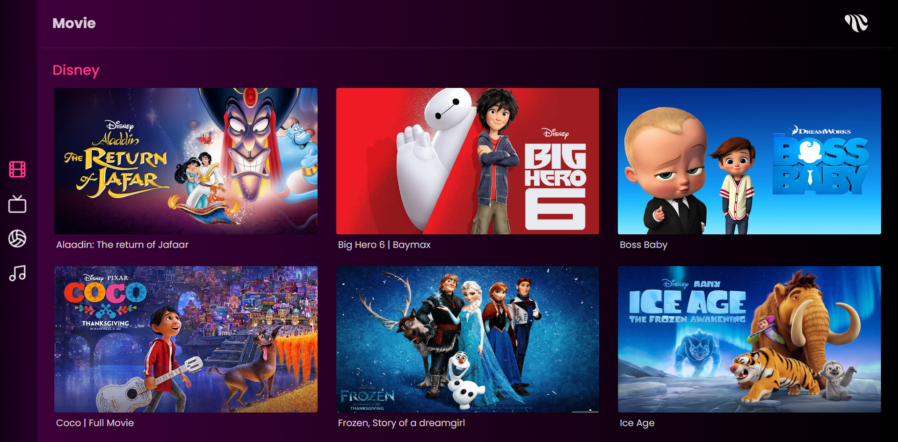
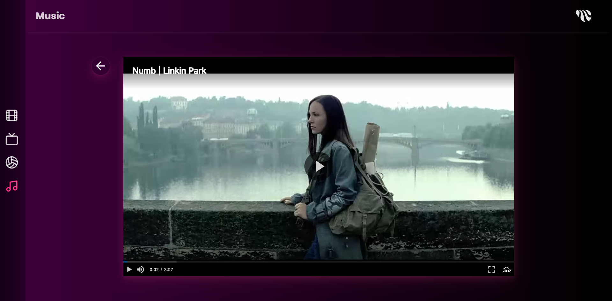

# Toffe TV App

This `Demo OTT` web application offers seamless navigation using both keyboard and mouse controls. It features an integrated, customizable HLS video player for smooth streaming. The keyboard navigation functionality allows users to effortlessly browse through content, making it easily adaptable for use as a `TV App`.

**Live Preview: [TOFFEE TV APP](https://toffee-wnl9.onrender.com/)**

## Tech & Tools
- React.js
- TailwindCSS
- Cloudinary Video Player
  
## Features
- Appealing UI
- Keyboard (`UP ARROW` `DOWN ARROW` `LEFT ARROW` `RIGHT ARROW`) key-based navigation
- Customized Cloudinary Video Player integraion (HLS supported)
- Clean, well-structured codebase

## Screens

**Homepage**

**Video Player**

_Happy Coding :)_

